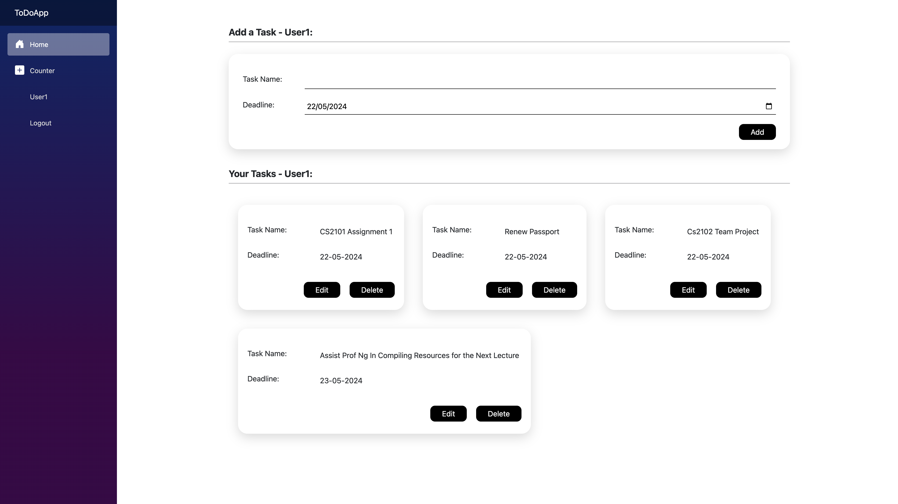

# Blazor ToDoApp with Authentication and Authorization

## Introduction

Welcome to the Blazor ToDoApp! This basic app demonstrates how to implement authentication and authorization using Blazor in .NET 8.



## Features

- User registration and login
- Role-based access control
- CRUD operations for ToDo items
- Protected routes

## Prerequisites

- [.NET 8 SDK](https://dotnet.microsoft.com/download/dotnet/8.0)
- [Visual Studio 2022](https://visualstudio.microsoft.com/vs/) or [Visual Studio Code](https://code.visualstudio.com/)
- [SQLite](https://www.sqlite.org/download.html)

### Run the Application

```bash
dotnet run
```

## Authentication and Authorization

- **Authentication**: Using ASP.NET Core Identity for user registration and login.
- **Authorization**: Role-based, with Admin and User roles for access control.
